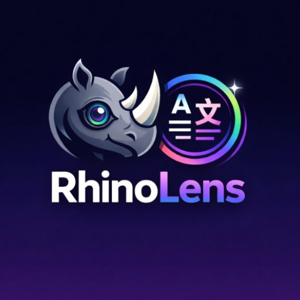

# RhinoLens

<p align="center">
  
</p>

Live, in-place camera translation. Point your phone at foreign text (signs, menus, packaging) and see it translated where it sits, frame by frame. All on-device, no network round-trips.

## What it does

- **Live AR translation**: CameraX preview with on-device OCR; detected text blocks are tracked, smoothed, and rewritten in your target language over the live frame.
- **19 languages**: Arabic, Chinese, Dutch, English, French, German, Hindi, Indonesian, Italian, Japanese, Korean, Polish, Portuguese, Russian, Spanish, Thai, Turkish, Ukrainian, Vietnamese.
- **Auto language detection**: if you don't pick a source language, ML Kit's language ID infers it from the recognised text.
- **Import image**: translate text from a photo in your gallery without firing up the camera.
- **Library**: every capture is saved to a local Room database; tap one to see source + translation side by side and share the composite.
- **Settings**: light / dark / system theme, dynamic colour toggle, language pack management (download/delete on-device translation models), and a "clear captures" action.
- **Pinch-to-zoom** on the camera preview.

## Architecture

Kotlin Multiplatform with a thin platform shell. Android ships; iOS has a SwiftUI scaffold wired to the shared bindings.

```
shared/                 KMP common code, no Android/iOS imports
  domain/               Capture, Language, OcrFrame, TextBlock, TranslatedBlock, ...
  port/                 TranslationEngine, CaptureRepository, SettingsRepository, ModelPackManager
  orchestrator/         TranslationOrchestrator + LruCache + BboxSmoother
  platform/             SwiftMutableStateFlow helper for iOS interop

androidApp/             Compose UI + Android adapters
  camera/               CameraScreen, AROverlay, CameraXOcrSource, LanguagePickerSheet
  home/ library/ settings/ importimg/ capturedetail/
  data/                 Room + DataStore + ML Kit adapters
  nav/                  Navigation Compose host

iosApp/                 SwiftUI scaffold (xcodegen project)
```

The **`TranslationOrchestrator`** is the heart of the live flow. It takes a `Flow<OcrFrame>` from the platform OCR source, filters by confidence, smooths bounding boxes (EMA, α=0.6) so the overlay doesn't jitter, fans out translations through a bounded semaphore (max 4 in flight), caches results in a 256-entry LRU keyed by `(text, source, target)`, and emits `List<TranslatedBlock>` for the overlay to draw. Source language is resolved either explicitly or via ML Kit language ID on a 200-char sample.

## Tech

| Layer | Tech |
|---|---|
| UI | Jetpack Compose, Material 3, Navigation Compose |
| Camera | CameraX (`LifecycleCameraController`, ML Kit vision analyzer) |
| OCR | ML Kit Text Recognition v2 (Latin, Chinese, Devanagari, Japanese, Korean) |
| Translation | ML Kit on-device translation + Language ID |
| Persistence | Room (captures), DataStore Preferences (settings) |
| Image loading | Coil |
| Shared | Kotlin 2.0.21, KMP, kotlinx.coroutines, kotlinx.serialization, kotlinx.datetime |
| Build | AGP 9.0.1, KSP, Gradle version catalogs |
| iOS | Swift 5.9, SwiftUI, deployment target iOS 18.0, xcodegen |

## Build

### Android

```bash
./gradlew :androidApp:assembleDebug
# APK at androidApp/build/outputs/apk/debug/androidApp-debug.apk
```

`assembleRelease` works but `release` reuses no signing config, so the resulting APK is unsigned. Add a `signingConfigs` block to `androidApp/build.gradle.kts` before distributing.

Min SDK 24, target/compile SDK 36.

### iOS

```bash
cd iosApp
xcodegen generate
open RhinoLens.xcodeproj
```

The Xcode build invokes `./gradlew :shared:embedAndSignAppleFrameworkForXcode` as a pre-build step to (re)produce `Shared.framework`.

## Permissions

- `CAMERA`: the live translation preview.
- `INTERNET`: ML Kit's first-time model downloads (translation packs, recognisers).

## License

Not yet specified.
